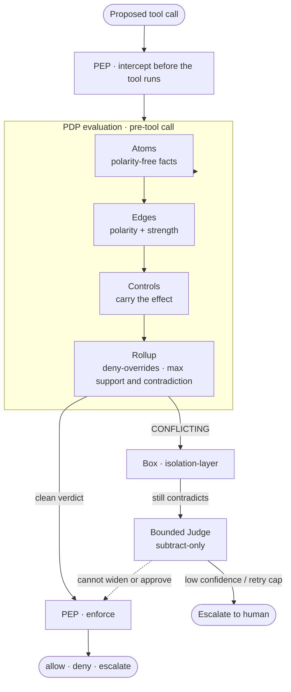

<!--
Author:  Landen Stecker
Date:    2026-08-19
Version: 0.2.3
Summary: Public README for aegis-atoms. Stakes first, then the three-object invention, then maps.
-->

<div align="center">

# Aegis atoms

</div>

A static allowlist is necessary and not sufficient. It cannot see a path that aliases out of its root, a command that hides executable structure in an argument, or an instruction that arrives as ordinary content. An agent thinks in text, and every real consequence is a tool call; this plane sits on the line between the two.

An atom is a fact with no opinion. It cannot authorize, DENY or ABSTAIN, never yes, because polarity and strength live on the edge, the effect lives on the control, and the rollup combines them deny-overrides, tracking maximum support and maximum contradiction independently rather than summing, so an allow that outranks a block cannot be expressed and argument order cannot change the result. Keeping the three objects apart is the point: the moment an atom carries its own effect it stops being reusable and becomes a decision. Support and contradiction both firing is CONFLICTING, and that case is the named handoff to the box.

This repository is the atom plane and a bounded judge, as source. The allowlist that gates tool calls is capability-gate, on a separate roof. The floor decides, the judge doubts, the box contains, and the audit attests.

<div align="center">


</div>

| | Here | Live, on the Hermes aegis profile |
|---|---|---|
| Allowlist floor | not this roof | capability-gate, enforce |
| Triad plugin | source | not mounted |
| Judge | subtract-only, proven | `judge_apply_verdict=False` |
| Irreversible ops | default off | not enabled |
| Catalog | `catalog/Aegis-Atoms-v0.yaml`: 15 atoms, 2 delegates | mostly dormant |

`evaluate_tool_call` defaults `judge_apply_verdict` to True, so a caller who omits the argument applies; the live mount passes False. `property_fuzzer.py` runs both paths on purpose: apply, to earn the subtract-invariant receipt, and observe, to mirror the mount. BREAK lives in `evidence/j3/negative-controls.md`: those pytest functions monkeypatch the wire so the invariant fails, and going red is the proof the detector works. A green 10k run whose control was never exercised is a green on nothing. The tree carries 28 root Python modules and two evidence directories, with receipted 10k runs on both the apply subtract and the observe telemetry paths.

## Four-plane authority

| Plane | Where it lives | Grade here |
|---|---|---|
| Floor (allowlist) | `Steck43/capability-gate` on `profiles/aegis` | live enforce, other roof |
| Floor (atom plane) | this tree | source-present |
| Judge | this tree (`bounded_judge.py`, J3) | proven, subtract-only; live mount keeps `judge_apply_verdict=False` |
| Box | separate Rust tree | isolation-layer, not consumed here |
| Audit | vault ledger | not shipped in this git |

Memory is a governed surface, not a fifth plane, because it does not expire or delete on its own authority.

## How a decision is made



PDP evaluate is a pre-tool call: the tool has not run yet, the call goes to atoms, and a contradiction the rollup cannot settle goes to the box. On the live Hermes profile the engine can compute that subtract and discard it, because `judge_apply_verdict` is False; today the call still meets the allowlist and runs.

## The three-object model

| Object | Carries | Never carries |
|---|---|---|
| **Atom** | a polarity-free fact ("this path resolves outside its root") | polarity, effect, framework mapping |
| **Edge** | polarity (`supports` / `contradicts`) and strength | the effect |
| **Control** | the effect (`allow` to `block`) and the framework mappings | the raw fact |

## The four governed surfaces

| Surface | Atom | Fires when | Certainty |
|---|---|---|---|
| **Action gating** | path · shell | a path resolves outside its allowed root; a command carries executable structure the schema forbids | structural · `1.0` |
| **Content detection** | indirect marker · output replication | incoming content carries known prompt-injection markers; agent output mirrors an injection-bearing untrusted input | heuristic · `< 1.0` |
| **Memory governance** | flow | secret-origin data reaches a durable-note or egress sink | structural · `1.0` |
| **Supply chain** | tool integrity · undeclared egress | an invoked tool's version or declared metadata drifts from its approved baseline | structural · `1.0` |

## What the suite measures

The atoms harness runs eighteen callables from `adversarial_suite.ALL_CASES`. Sixteen are attacks: seven hard-deny as `CAUGHT-NAIVE`, eight `FALSE-ALLOW`, and H1 `HALTED`, which sits in the sixteen and not in the hard-deny numerator. The two benign cases split `CORRECT-ALLOW` and `FALSE-DENY`. Fixture-era 8/16 is a prior KPI. The capability-gate Stage-1 lab is a different harness, and a tally that does not name which is not a comparable number.

Framework mappings reference OWASP (LLM and Agentic Top 10), MITRE ATLAS `v2026.06` (`mitre-atlas/atlas-data` `dist/v6/ATLAS-2026.06.yaml`), and NIST AI RMF, and live on the control.

## The bounded judge

The judge can concur, flag, tighten, or escalate; it cannot issue a floor verdict, and it cannot widen or approve. Receipts live at `evidence/j3/j3-property-10k.json` for apply and `evidence/j3/j3-observe-telemetry-10k.json` for observe.

## History

This code lived in-tree in a Hermes-agent fork under `aegis-plugins/aegis-atoms`; history stays there, and this repository is an allowlist extract of that tree.

## Verifying this tree

Every tracked file is listed in `SHA256SUMS`. From a fresh clone:

```
sha256sum -c SHA256SUMS
```

The manifest is generated, not maintained. `scripts/gen_manifest.sh` reads each
path from the git index rather than the working tree, so the rows are the bytes
the repository stores and not the bytes any one checkout happens to hold. CI
regenerates it on every push and fails if the committed file differs, then runs
the command above against a clean checkout.

## Status

Capability-gate is the live allowlist. This roof stays observe: atoms enforce and a live `judge_apply_verdict=True` mount wait on a separate GO.

---

<div align="center">

*Built by Landen Stecker · CISSP · MS AI, Santa Clara University*

</div>
