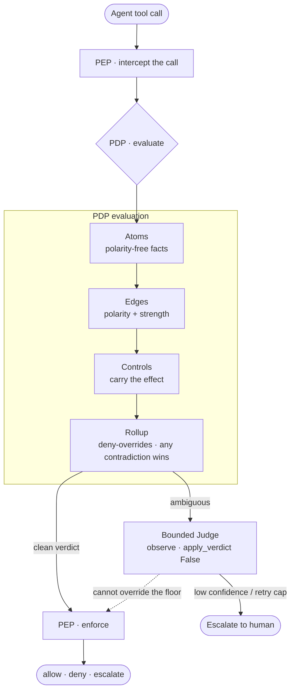

<!--
Author:  Landen Stecker
Date:    2026-08-19
Version: 0.2.0
Summary: Public README for aegis-atoms — atom plane plus bounded judge (observe).
-->

# Aegis atoms

**Atom plane + bounded judge (observe).** Not the live allowlist.

The floor decides. The judge doubts. The box contains. The audit attests.

---

CLAIM: this tree is the **atom plane** and a **bounded judge mounted observe**. The live allowlist on `profiles/aegis` is **capability-gate**, a separate roof. BREAK: do not read this README as “the judge is live” or “atoms enforce tool calls.” Live `__init__.py` passes `judge_apply_verdict=False`. The triad plugin is **not mounted**. Most catalog atoms are **dormant**. `irreversible_ops_enabled` is not passed (engine default False).

Inventory: **28** root Python modules, **30** evidence directories, two receipted 10k runs (apply subtract + observe telemetry). No line-count in this file.

## Four-plane authority

> The floor decides. The judge doubts. The box contains. The audit attests.

That sentence is from the containment topic, quoted verbatim. This repository is not all four planes:

| Plane | Where it lives | Grade here |
|---|---|---|
| Floor (allowlist) | `Steck43/capability-gate` on `profiles/aegis` | live enforce — **not this repo** |
| Floor (atom plane) | this tree | source-present; plugin loaded **observe** |
| Judge | this tree (`bounded_judge.py`, J3) | consumer exists; **apply_verdict=False** |
| Box | separate Rust tree | not consumed by this plugin |
| Audit | vault ledger | not shipped in git |

Memory is a governed surface, not a fifth plane.

## Why this exists

An agent thinks and it acts. Thinking is text. Acting is a tool call. A static allowlist is necessary and not sufficient: it is structurally blind to capability aliasing, argument evasion, context, composition, and injection. Atoms are polarity-free facts. Edges carry polarity. Controls carry effect. Combination is deny-overrides.

## How a decision is made

Observe means consult + telemetry. The engine can compute a subtract and then discard it when `judge_apply_verdict` is False. That is the live mount. Apply-path proofs use a separate fuzzer receipt with `plugin_mode=enforce`.

## The three-object model

| Object | Carries | Never carries |
|---|---|---|
| **Atom** | a polarity-free fact ("this path resolves outside its root") | polarity, effect, framework mapping |
| **Edge** | polarity (`supports` / `contradicts`) and strength | the effect |
| **Control** | the effect (`allow`…`block`) and the framework mappings | the raw fact |

## The four governed surfaces

| Surface | Atom | Fires when | Certainty |
|---|---|---|---|
| **Action gating** | path · shell | a path resolves outside its allowed root; a command carries executable structure the schema forbids | structural · `1.0` |
| **Content detection** | indirect marker · output replication | incoming content carries known prompt-injection markers; agent output mirrors an injection-bearing untrusted input | heuristic · `< 1.0` |
| **Memory governance** | flow | secret-origin data reaches a durable-note or egress sink | structural · `1.0` |
| **Supply chain** | tool integrity · undeclared egress | an invoked tool's version or declared metadata drifts from its approved baseline | structural · `1.0` |

## What the suite measures

Two harnesses. Do not collapse the numbers.

**Adversarial suite (atoms KPI):** **7/16** hard-deny. H1 is `HALTED` via `require_approval` and is not in the numerator. Total suite cases: 18 (16 attack + benign). Fixture-era 8/16 is not the live KPI.

**CG Stage-1 lab** is a different harness on the capability-gate roof. Name which suite when you cite a tally.

Framework mappings reference OWASP (LLM & Agentic Top 10), MITRE ATLAS `v2026.06` (`mitre-atlas/atlas-data` `dist/v6/ATLAS-2026.06.yaml`), and NIST AI RMF, and live on the control, not the atom.

## The bounded judge

The judge can concur, flag, or add nuance. It cannot issue a floor verdict and cannot override the deterministic floor. Live mount: `judge_apply_verdict=False`. Receipts: `evidence/j3/j3-property-10k.json` (apply) and `evidence/j3/j3-observe-telemetry-10k.json` (observe).

Engine default if a caller omits `judge_apply_verdict` is `True`. That is a footgun. This plugin does not omit it. Do not flip the default without a Landen GO.

## History

This code lived in-tree in a Hermes-agent fork under `aegis-plugins/aegis-atoms`. History stays there. A public extract is a deliberate allowlist copy into a new repository, not a dump of the fork, and not a Nous Research LICENSE.

## Status

**Observe.** Capability-gate stays the live allowlist. Atoms enforce and `apply_verdict=True` are not next-up in this README. They are a separate GO.

---

Built by **Landen Stecker** · CISSP · M.S. AI, Santa Clara University

